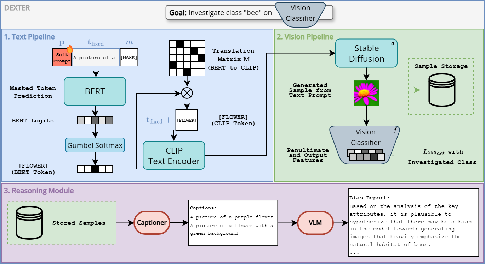

<div align="center">

# DEXTER: Diffusion-Guided EXplanations with TExtual Reasoning for Vision Models
Simone Carnemolla, Matteo Pennisi, Sarinda Samarasinghe, Giovanni Bellitto, Simone Palazzo, Daniela Giordano, Mubarak Shah, Concetto Spampinato

</div>

## Abstract
Understanding and explaining the behavior of machine learning models is essential for building transparent and trustworthy AI systems. We introduce DEXTER, a data-free framework that employs diffusion models and large language models to generate global, textual explanations of visual classifiers. DEXTER operates by optimizing text prompts to synthesize class-conditional images that strongly activate a target classifier. These synthetic samples are then used to elicit detailed natural language reports that describe class-specific decision patterns and biases. Unlike prior work, DEXTER enables natural language explanation about a classifier's decision process without access to training data or ground-truth labels. We demonstrate DEXTER's flexibility across three tasks—activation maximization, slice discovery and debiasing, and bias explanation—each illustrating its ability to uncover the internal mechanisms of visual classifiers. Quantitative and qualitative evaluations, including a user study, show that DEXTER produces accurate, interpretable outputs. Experiments on ImageNet, Waterbirds, CelebA, and FairFaces confirm that DEXTER outperforms existing approaches in global model explanation and class-level bias reporting.

[](https://arxiv.org/abs/2510.14741) [](https://openreview.net/forum?id=baBhSzaSHI)

<p align="center"></p>

## Prerequisites
- Hugging Face credentials so diffusers can pull Stable Diffusion weights (`huggingface-cli login` once).
- An OpenAI-compatible LLM/VLM endpoint: OpenAI API key or a local Ollama server.

## Setup
```bash
uv venv
source .venv/bin/activate
uv pip install --upgrade pip
uv pip install -r requirements.txt
huggingface-cli login   # first-time download of SD weights
```

## Checkpoints
- Download **RobustResNet50** weights from [here](https://github.com/singlasahil14/salient_imagenet). Rename the file to `robust_resnet50.pth` and place it in `checkpoints/`.
- More info about classifiers trained on Waterbirds and Fairfaces will be released soon. 

## Run DEXTER:
OpenAI endpoint (used in the paper):
```bash
python main.py \
  --class_to_activate 291 \
  --classifier robust50 \
  --optim_steps 1000 \
  --vlm_id gpt-4o \
  --llm_id gpt-4o \
  --api_key $OPENAI_API_KEY
  --base_url https://api.openai.com/v1
```

Local/Ollama endpoint:
```bash
python main.py \
  --class_to_activate 291 \
  --classifier robust50 \
  --vlm_id llava:13b \
  --llm_id gpt-oss:120b \
  --api_key dummy \
  --base_url http://localhost:11434/v1
```

Key flags:
- `--classifier`: `robust50,  resnet50, vit_b_16`. More classifiers will be released soon.
- `--mask_type`: `multi_mask` (default) or `single_mask` for a single-word optimization.

Outputs (per run) in `out/<class>_<timestamp>-<runid>/`:
- `frames/*.png`: frames where the classifier predicts the target class.
- `args.json`: run configuration.
- `pred_words.txt`, `<class>_prompt.txt`: prompt/word candidates.
- `caption.txt`, `report.txt`, `as_dexter_prompts.txt`, `as_captions.txt`: captions, reports, and activation scores.

## Programmatic use
Prompt optimization only (skip LLM/VLM reasoning):
```python
from dexter import DEXTER, RunConfig, build_classifier_and_transforms

cfg = RunConfig(class_to_activate=291, classifier="robust50", optim_steps=100)
clf, tfms = build_classifier_and_transforms(cfg.classifier, device="cuda", use_tfms=True)
dexter = DEXTER(cfg, device="cuda")
run_dir = dexter.analyze_classifier(clf, tfms)
print("Saved to", run_dir)
```

Activation score utility:
```python
from dexter.classifiers import build_classifier_and_transforms
from dexter.metrics.activation_score import activation_score

clf, tfms = build_classifier_and_transforms("robust50", device="cuda", use_tfms=True)
score, last_img, mean_act = activation_score(
    classifier=clf,
    prompt="YOUR PROMPT",
    class_to_activate=145,
    n_images=100,
    transforms=tfms,
    device="cuda",
)
print("Activation score:", score, "Mean activation:", mean_act)
```

## Prompt configuration
System prompts for the captioner and reporter live in `sp_config/` (`captions_sp.txt`, `report_sp.txt`). Edit them to steer VLM/LLM tone and bias notes.

## Troubleshooting
- Missing Stable Diffusion weights: run `huggingface-cli login` and retry; diffusers will download automatically.
- Missing checkpoints: ensure file names/paths match the list in the Checkpoints section.
- OpenAI/Ollama errors: confirm `--api_key`/`--base_url` match your provider and that the model IDs exist.

## Citation
If you use this repository in your research, please cite it as:
```bibtex
@article{carnemolla2025dexter,
  title={DEXTER: Diffusion-Guided EXplanations with TExtual Reasoning for Vision Models},
  author={Carnemolla, Simone and Pennisi, Matteo and Samarasinghe, Sarinda and Bellitto, Giovanni and Palazzo, Simone and Giordano, Daniela and Shah, Mubarak and Spampinato, Concetto},
  journal={arXiv preprint arXiv:2510.14741},
  year={2025}
}
```
