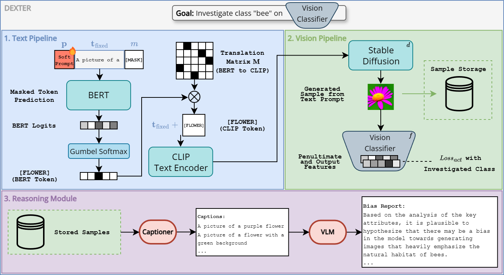

# DEXTER: Diffusion-Guided EXplanations with TExtual Reasoning for Vision Models
Simone Carnemolla, Matteo Pennisi, Sarinda Samarasinghe, Giovanni Bellitto, Simone Palazzo, Daniela Giordano, Mubarak Shah, Concetto Spampinato

## Abstract
Understanding and explaining the behavior of machine learning models is essential for building transparent and trustworthy AI systems. We introduce DEXTER, a data-free framework that employs diffusion models and large language models to generate global, textual explanations of visual classifiers. DEXTER operates by optimizing text prompts to synthesize class-conditional images that strongly activate a target classifier. These synthetic samples are then used to elicit detailed natural language reports that describe class-specific decision patterns and biases. Unlike prior work, DEXTER enables natural language explanation about a classifier's decision process without access to training data or ground-truth labels. We demonstrate DEXTER's flexibility across three tasks—activation maximization, slice discovery and debiasing, and bias explanation—each illustrating its ability to uncover the internal mechanisms of visual classifiers. Quantitative and qualitative evaluations, including a user study, show that DEXTER produces accurate, interpretable outputs. Experiments on ImageNet, Waterbirds, CelebA, and FairFaces confirm that DEXTER outperforms existing approaches in global model explanation and class-level bias reporting.

@article{carnemolla2025dexter,
  title={DEXTER: Diffusion-Guided EXplanations with TExtual Reasoning for Vision Models},
  author={Carnemolla, Simone and Pennisi, Matteo and Samarasinghe, Sarinda and Bellitto, Giovanni and Palazzo, Simone and Giordano, Daniela and Shah, Mubarak and Spampinato, Concetto},
  journal={arXiv preprint arXiv:2510.14741},
  year={2025}
}
